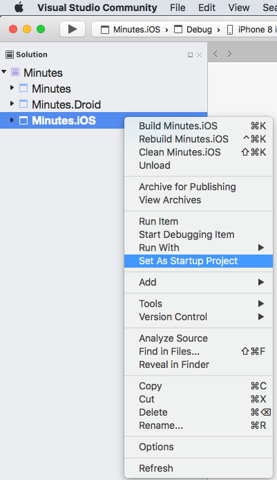
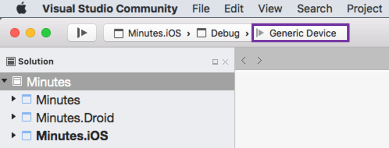
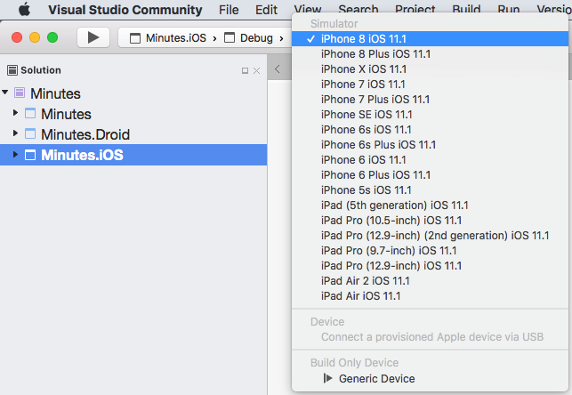
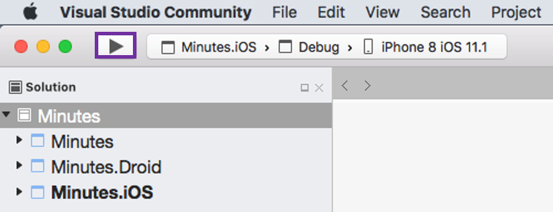
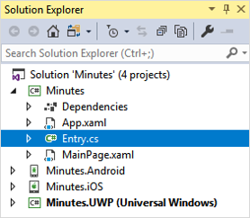
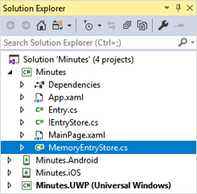
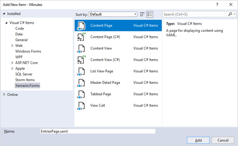

# Build My First Xamarin App

## Exercise 1.0 - Create solution

In this walk-through, we will create a new Xamarin.Forms solution in Visual Studio.

We will use Visual Studio on Windows in the instructions, so we get projects for Windows, Android, and iOS. You can also create the solution using Visual Studio for Mac; however, this will only create projects targeting Android and iOS.

**Steps in this exercise**

-   **Exercise 1.1 - Select template**: Select the Xamarin.Forms application template in Visual Studio.

-   **Exercise 1.2 - Choose options**: Select all the application options to create a new Xamarin.Forms app.

### Exercise 1.1 - Select template

1.  Launch Visual Studio.

2.  Navigate to **File > New > Project...**

3.  In the **New Project** window, navigate to the **Installed > Visual C# > Cross-Platform** section.

4.  Select the **Cross-Platform App (Xamarin.Forms)** template.

5.  Enter **"Minutes"** in the **Name** field.

6.  Enter a folder in the **Location** field.
	> **Note:** On Windows, we recommend using a folder close to the root of your drive to avoid path-length issues.

7.  Click the **OK** button.


### Exercise 1.2 - Choose options

1.  Select the **Blank App** template.

2.  Select the **Android**, **iOS**, and **Windows (UWP)** platforms.

3.  Select **Xamarin.Forms** as the UI Technology.

4.  Select **.NET Standard** as the Code Sharing Strategy.

5.  Click the **OK** button to create the solution.

6.  The template will create four projects: one for the shared code and three for the platform-specific apps. If you would like to, please take a few minutes to explore the code in Visual Studio.


## Exercise 2.0 - Run on Windows

Here we will execute the **Minutes.UWP** app on Windows. We will run on the Local Machine instead of the Windows simulator. This will give us quick deployment and fast startup which is convenient during development and testing.

**Steps in this exercise**

-   **Exercise 2.1 - Set Startup Project**: Set the Minutes.UWP project as the Startup Project in our solution.

-   **Exercise 2.2 - Run the app**: Run the Minutes.UWP app on the Local Machine.

### Exercise 2.1 - Set Startup Project

1.  In the **Solution Explorer**, locate the **Minutes.UWP (Universal Windows)** project.

2.  Right-click on the **Minutes.UWP (Universal Windows)** project.

3.  In the context menu, select **Set as StartUp Project**.


### Exercise 2.2 - Run the app

1.  On the **Standard** toolbar, locate the **Debug Target** button.


2.  Verify that the text on the **Debug Target** button is **"Local Machine"**. If it is not, select the disclosure arrow on the side of the **Debug Target** button and choose **"Local Machine"** from the context menu.


3.  Click the **Debug Target** button to run the app.

## Exercise 3.0 - Run on Android

Here we will execute the **Minutes.Android** app on Windows. We will use an Android emulator to run the application because it lets us test on different Android versions and form factors.

**Steps in this exercise**

-   **Exercise 3.1 - Set Startup Project**: Set the Minutes.Android project as the Startup Project in the solution.

-   **Exercise 3.2 - Run the app**: Run the Android head project on an emulator.

### Exercise 3.1 - Set Startup Project

1.  In the **Solution Explorer**, locate the **Minutes.Android** project.

2.  Right-click on the **Minutes.Android** project.

3.  In the context menu, select the **Set as StartUp Project** entry.


### Exercise 3.2 - Run the app

1.  On the **Standard** toolbar, locate the **Debug Target** button.


2.  Verify that the text on the **Debug Target** button is some version of an Android emulator. If it is not, select the disclosure arrow on the side of the **Debug Target** button and choose an Android emulator from the context menu.


3.  Click the **Debug Target** button to run the app.

## Exercise 4.0 - Run on iOS

Here we will run the **Minutes.iOS** app on macOS and Windows. We will use the iOS simulator to avoid the need for a physical device.

Note: You need a Mac for this exercise because part of the build process and execution of the iOS simulator must occur on a Mac.

**Steps in this exercise**

-   **Exercise 4.1 - Set Startup Project**: Set the Minutes.iOS project as the Startup Project in the solution.

-   **Exercise 4.2 - Run the app on macOS**: Use Visual Studio for Mac to launch the iOS simulator and run the app.

-   **Exercise 4.3 - Run the app on Windows**: Use Visual Studio on Windows to launch the iOS simulator and run the app.

### Exercise 4.1 - Set Startup Project

1.  In the **Solution Explorer**, locate the **Minutes.iOS** project.

2.  Right-click on the **Minutes.iOS** project.

3.  In the context menu, select **Set as StartUp Project**.




### Exercise 4.2 - Run the app on macOS

Note: You can skip this step if you are using a Windows PC for your development machine.

1.  On the main toolbar, click on the button that lets you select your target platform.



2.  Select your preferred simulator version from the context menu.



7.  Click the **run** button to run the application.



### Exercise 4.3 - Run the app on Windows

1.  On the **Standard** toolbar, locate the **Solution Platforms** drop-down.


2.  Verify that the text on the **Solution Platforms** drop-down is **"iPhoneSimulator"**. If it is not, select the disclosure arrow on the side of the **Solution Platforms** drop-down and choose **"iPhoneSimulator"** from the context menu.


3.  Open the **Tools** **>** **Options...** menu.

4.  Navigate to the **Xamarin** **>** **iOS Settings** section.

5.  In the **"Simulator"** area, choose where the simulator window will be displayed.

    -   Check **Remote Simulator to Windows** to display the iOS simulator on the Windows PC.

    -   Uncheck **Remote Simulator to Windows** to show it on the Mac.


6.  Select the disclosure arrow on the side of the **Debug Target** button and choose your preferred iOS simulator from the context menu.


7.  Click the **Debug Target** button to run the app.


## Exercise 5.0 - Code the Entry class

Here we will implement the **Entry** data-model class.

**Steps in this exercise**

-   **Exercise 5.1 - Create the class**: Add a new **Entry** class to the shared-code project.

-   **Exercise 5.2 - Add properties**: Add properties to store the minutes text and metadata.

-   **Exercise 5.3 - Initialize properties**: Set default values for the **CreatedDate** and **Id** properties.

-   **Exercise 5.4 - Override ToString**: Code the **ToString** method for later use with **ListView**.

### Exercise 5.1 - Create the class

1.  Add a new class to the **Minutes** shared-code project. Name it **Entry**.



2.  Add `public` to the class definition.

### Exercise 5.2 - Add properties

1.  Add a public, read-write property of type `string` to the **Entry** class. Name it **Title**.

2.  Add a public, read-write property of type `string` to the **Entry** class. Name it **Content**.

3.  Add a public, read-write property of type `DateTime` to the **Entry** class. Name it **CreatedDate**.

4.  Add a public, read-write property of type `string` to the **Entry** class. Name it **Id**.

The completed code is shown below for convenience:

```csharp
public class Entry
{
	public string Title { get; set; }
	public string Content { get; set; }
	public DateTime CreatedDate { get; set; }
	public string Id { get; set; }
}
```

### Exercise 5.3 - Initialize properties

1.  Add a no-argument constructor to the **Entry** class.

2.  Initialize the **CreatedDate** property to the current time. Use `DateTime.Now` to get the value.

3.  Initialize the **Id** property to a string derived from a `System.Guid` object. Use `Guid.NewGuid().ToString()` to get the value.

The completed code is shown below for convenience:

```csharp
public class Entry
{
	...
	public Entry()
	{
		CreatedDate = DateTime.Now;
		Id = Guid.NewGuid().ToString();
	}
}
```

### Exercise 5.4 - Override ToString

1.  Override the `ToString` method in the **Entry** class.

2.  Concatenate the entry's **Title** with the **CreatedDate** and return the result.

3.  Build the solution to check for syntax errors.

The completed code is shown below for convenience:

```csharp
public class Entry
{
	...
	public override string ToString()
	{
		return $"{Title} {CreatedDate}";
	}
}
```

## Exercise 6.0 - Code the MemoryEntryStore class

Here we will code the **MemoryEntryStore** class, which will store a collection of **Entry** objects in memory.

**Steps in this exercise**

-   **Exercise 6.1 - Create the class**: Add a new **MemoryEntryStore** class to the shared-code project.

-   **Exercise 6.2 - Implement the methods**: Store the **Entry** objects in an in-memory dictionary.

-   **Exercise 6.3 - Create sample data**: Generate mock data to use for testing.

-   **Exercise 6.4 - Instantiate the store**: Create a **static** instance of **MemoryEntryStore** inside your **App** class.

### Exercise 6.1 - Create the class

1.  Add a new class to the **Minutes** shared-code project. Name it **MemoryEntryStore**.



2.  Add `public` to the class definition.

### Exercise 6.2 - Implement the methods

1.  Add the dictionary field shown below to the class.

```csharp
Dictionary<string, Entry> entries = new Dictionary<string, Entry>();
```

2.  Implement the **Write** method.

```csharp
public void Write(Entry entry)
{
	entries[entry.Id] = entry;
}
```

3.  Add a `using` statement for the **System.Linq** namespace to the top of the file.

```csharp
using System.Linq;
```

4.  Implement the **Read** method.

```csharp
public List<Entry> Read()
{
	return entries.Values.ToList();
}
```

4.  Build the solution to check for syntax errors.

### Exercise 6.3 - Create sample data

1.  Add a new class to the **Minutes** shared-code project. Name it **MockDataExtensionMethods**.

2.  Add `public` and `static` to the class definition.

3.  Add the extension method given below into the **MockDataExtensionMethods** class.

```csharp
public static void LoadMockData(this MemoryEntryStore store)
{
	var a = new Entry { 
		Title = "Sprint Planning Meeting", 
		Content = "1. Scope 2. Backlog 3. Duration" 
	};

	var b = new Entry { 
		Title = "Daily Scrum Stand-up", 
		Content = "1. Yesterday 2. Today 3. Impediments" 
	};
	
	var c = new Entry { 
		Title = "Sprint Retrospective", 
		Content = "1. Reflection 2. Actions" 
	};
	
	store.Write(a);
	store.Write(b);
	store.Write(c);
}
```

### Exercise 6.4 - Instantiate the store

1.  Open the file **App.xaml.cs** in the shared-code project.

2.  Add the property shown below to the **App** class.

```csharp
public static MemoryEntryStore Entries { get; set; }
```

3.  In the **App** constructor, instantiate a **MemoryEntryStore** object and assign it to the **Entries** property.

4.  In the **App** constructor, invoke the **LoadMockData** extension method on **Entries** to fill it with sample data.

5.  Build the solution to check for syntax errors.

The code is shown below for convenience.

```csharp
public partial class App : Application
{
	public static MemoryEntryStore Entries { get; set; }

	public App ()
	{
		InitializeComponent();
		
		MainPage = new MainPage();
		Entries = new MemoryEntryStore();
		Entries.LoadMockData();
	}
}
```

## Exercise 7.0 - Code the EntriesPage using XAML

Here we will create the **EntriesPage** and set it as our app's **MainPage**.

**Steps in this exercise**

-   **Exercise 7.1 - Create the page**: Add a new XAML page to the shared-code project.

-   **Exercise 7.2 - Set MainPage**: Display the **EntriesPage** at app startup.

-   **Exercise 7.3 - Remove the default page**: Delete the **MainPage** class added by the starter template.

### Exercise 7.1 - Create the XAML page

1.  Right-click on the shared-code project in the **Solution Explorer** and select **Add** **>** **New Item...**. This will open the **Add New Item** window.

2.  Select the **Xamarin Forms** category.

3.  Select the **Content Page** item. Please read the item's description to verify you are creating a XAML Content Page.



4.  Name the item **EntriesPage**.

5.  Click **Add**. Two files will be created in the shared-code project: the XAML user interface and the C# code-behind.


6.  Open **EntriesPage.xaml**.

7.  The page template typically creates a `Label` containing sample text similar to that shown below. This is what you should expect to see when you run the app later in this exercise.

```csharp
<Label Text="Welcome to Xamarin.Forms!" ... />
```

### Exercise 7.2 - Set MainPage

1.  Open **App.xaml.cs** in the shared-code project.

2.  Locate the **App** class constructor.

3.  Locate the assignment to the App's **MainPage** property in the constructor (see below).

```csharp
MainPage = new MainPage();
```

4.  Modify the line that sets **MainPage** so it creates and assigns an instance of your **EntriesPage**.

5.  Run the app on at least one platform. You should see the **EntriesPage** displayed when the app starts.

### Exercise 7.3 - Remove the default page

1.  Locate the shared-code project in the **Solution Explorer**.

2.  Delete the files **MainPage.xaml** and **MainPage.xaml.cs**. We no longer need these because we will use our **EntriesPage** as our startup page.

## Exercise 8.0 - Display meeting minutes in a ListView

Here we will display the list of **Entry** objects in a **ListView** using the default visualization.

**Steps in this exercise**

-   **Exercise 8.1 - Add a ListView**: Add a **ListView** to the **EntriesPage** using XAML.

-   **Exercise 8.2 - Set the ListView ItemsSource**: Load the list of meeting minutes into the **ListView** using code.

### Exercise 8.1 - Add a ListView

1.  Open **EntriesPage.xaml** in the shared-code project.

2.  Remove the `StackLayout` and `Label` added by the starter template. When you are finished, the file should like the XAML shown below.

```xml
<?xml version="1.0" encoding="utf-8" ?>
<ContentPage xmlns="http://xamarin.com/schemas/2014/forms"
	xmlns:x="http://schemas.microsoft.com/winfx/2009/xaml"
	x:Class="Minutes.EntriesPage">
	
	<ContentPage.Content>
	</ContentPage.Content>

</ContentPage>
```

3.  Add a `ListView` inside the **ContentPage.Content** tags.

> **Note:** Please use traditional start and end tags for the `ListView` instead of a self-closing tag because we will add code inside the `ListView` tags in a later step.

4.  Use **x:Name** to assign the name **entries** to the `ListView`.

```xml
<ListView x:Name="entries">

</ListView>
```

### Exercise 8.2 - Set the ListView ItemsSource

1.  Open **EntriesPage.xaml.cs**.

2.  Override the `OnAppearing` method in the **EntriesPage** class.

3.  Inside `OnAppearing`, load the list of entries into the `ListView`.

```csharp
protected override void OnAppearing()
{
	base.OnAppearing();
	entries.ItemsSource = App.Entries.Read();
}
```

4.  Run the app on at least one platform. You should see the output of the `ToString` method displayed for each `Entry` object.

## Exercise 9.0 - Specify an Entry's visualization in a ListView

Here we will customize the display of **Entry** objects in the `ListView`.

**Steps in this exercise**

-   **Exercise 9.1 - Specify the DataTemplate**: Apply a **DataTemplate** to the **ListView**.

-   **Exercise 9.2 - Add the data bindings**: Use data binding to display the **Entry** data in the list cells.

### Exercise 9.1 - Specify the DataTemplate

1.  Open **EntriesPage.xaml** in the shared-code project.

2.  Locate the `ListView` in the XAML.

3.  Add open and close tags for `ListView.ItemTemplate` inside the `ListView`.

4.  Add open and close tags for a new `DataTemplate` inside the `ListView.ItemTemplate`.

5.  Add a `TextCell` inside the `DataTemplate`.

All your subsequent work will be done inside the open tag of the `TextCell`. This means you can use a self-closing tag for the `TextCell` instead of traditional open and close tags.

6.  Inside the `TextCell` element tag, assign the string "Entry Title" to the `Text` property.

7.  Inside the `TextCell` element tag, assign the string "Entry Date" to the `Detail` property.

8.  Inside the `TextCell` element tag, assign the color **Goldenrod** to the `DetailColor` property.

9.  Run the app on at least one platform. You should see the hard-coded values "Entry Title" and "Entry Date" displayed for each `Entry`.

The code is shown below for convenience.

```xml
<ListView x:Name="entries">
	<ListView.ItemTemplate>
		<DataTemplate>
			<TextCell
				Text="Entry Title"
				Detail="Entry Date"
				DetailColor="Goldenrod" />
		</DataTemplate>
	</ListView.ItemTemplate>
</ListView>>
```

> **Note:** Instead of hard-coded values, we want to display the data from the underlying **Entry** objects; we will do that in the next step.

### Exercise 9.2 - Add the data bindings

1.  Open **EntriesPage.xaml** in the shared-code project.

2.  Locate the `TextCell` in the XAML. All your work will be done inside the open tag of the `TextCell`.

3.  Replace the hard-coded assignment to `Text` with a `Binding` expression that displays the `Title` property of the underlying `Entry` object (see below).

```xml
<TextCell Text="{Binding Title}" ... />
```

4.  Replace the hard-coded assignment to `Detail` with a `Binding` expression that displays the **CreatedDate** property of the underlying **Entry** object. The full code is shown below for convenience.

```xml
<ListView x:Name="entries">
	<ListView.ItemTemplate>
		<DataTemplate>
			<TextCell
				Text="{Binding Title}"
				Detail="{Binding CreatedDate}"
				DetailColor="Goldenrod" />
		</DataTemplate>
	</ListView.ItemTemplate>
</ListView>>
```

5.  Run the app on at least one platform. You should see the values from the **Entry** objects displayed in the list.

