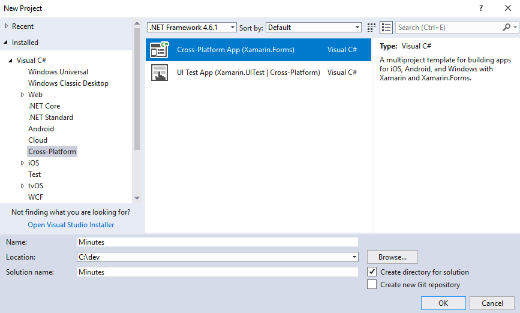
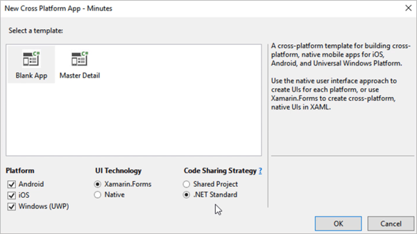
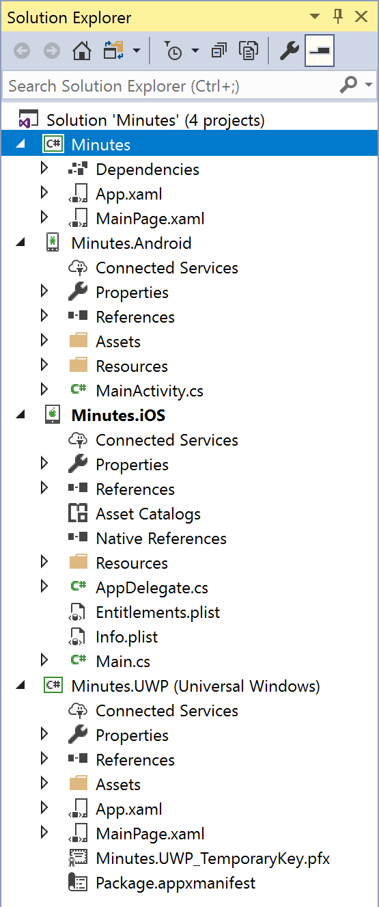
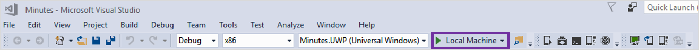
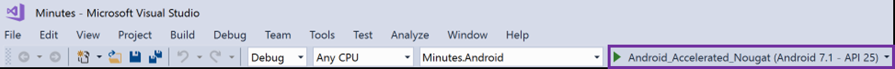
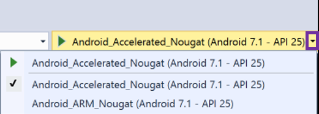
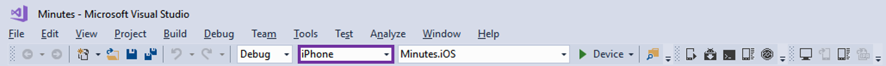
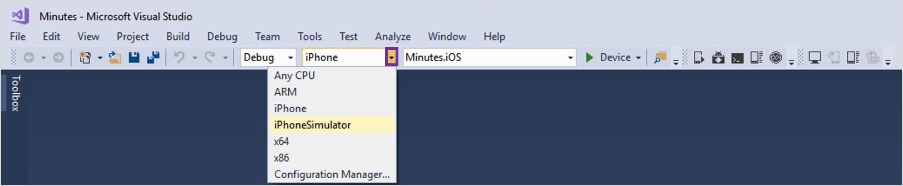
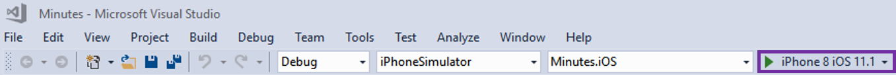
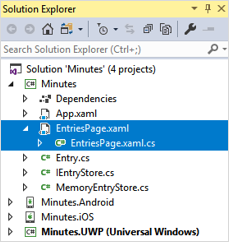

# Build My First Xamarin App

In this walk-through, we will create a new Xamarin.Forms solution in Visual Studio.

We will use Visual Studio on Windows in the instructions, so we get projects for Windows, Android, and iOS. You can also create the solution using Visual Studio for Mac; however, this will only create projects targeting Android and iOS.

> **Note** This lab assumes you are running Visual Studio on Windows 10 Fall Creators Update. If you are using an older version of Windows, you might be unable to run the UWP version of the application. In this case, you can skip those sections and concentrate on either iOS and/or Android.

## What you will learn
We will be creating a new Xamarin.Forms application and showing you how to construct basic UI using XAML, connect that UI to behavior in C# code, and navigate between multiple screens, sharing the data between them.

The app we will be building is a Minutes tracking application which could be used to take notes during meetings, keep track of things assigned to you, or just log your own personal thoughts. 

## Create solution
In this first step, we will create a new Xamarin.Forms application using the Visual Studio New Project wizard. 

### Select template

1.  Launch Visual Studio.

2.  Navigate to **File > New > Project...**

3.  In the **New Project** window, navigate to the **Installed > Visual C# > Cross-Platform** section.

4.  Select the **Mobile App (Xamarin.Forms)** template.

5.  Enter **"Minutes"** in the **Name** field.

6.  Enter a folder in the **Location** field.
	> **Note:** On Windows, we recommend using a folder close to the root of your drive to avoid path-length issues.



7.  Click the **OK** button.


### Choose project options

1.  Select the **Blank App** template.

2.  Select the **Android**, **iOS**, and **Windows (UWP)** platforms.

3.  Select **.NET Standard** as the Code Sharing Strategy.



4.  Click the **OK** button to create the solution.

## Explore the project

The wizard will create four projects: one for the shared code (as a .NET Standard library) and three for the platform-specific apps which can be run on the actual devices or simulator/emulators. 



| Project     | Description |
|-------------|-------------|
| **Minutes** | The .NET Standard shared code project. This is shared between all the platforms where your app will run and is also where almost all of your code will go. |
| **Minutes.Android** | The Xamarin.Android project which will generate the Android-specific binary package which can be deployed and run on any Android device. |
| **Minutes.iOS** | The Xamarin.iOS project which will generate the iOS-specific binary package which can be run on iPhone and iPad devices. |
| **Minutes.UWP** | The Universal Windows project which can be run on Windows 10 devices. This project is only available when you create the solution with Visual Studio for Windows. |

## Run on Windows

Here we will execute the **Minutes.UWP** app on Windows. We will run on the Local Machine instead of the Windows simulator. This will give us quick deployment and fast startup which is convenient during development and testing.

> **Note:** This requires Windows 10 Fall Creators Update.

### Set Startup Project

1.  In the **Solution Explorer**, locate the **Minutes.UWP (Universal Windows)** project.

2.  Right-click on the **Minutes.UWP (Universal Windows)** project.

3.  In the context menu, select **Set as StartUp Project**.


### Run the UWP app

1.  On the **Standard** toolbar, locate the **Debug Target** button.



2.  Verify that the text on the **Debug Target** button is **"Local Machine"**. If it is not, select the disclosure arrow on the side of the **Debug Target** button and choose **"Local Machine"** from the context menu.


3.  Click the **Debug Target** button to run the app.


## Run on Android

Here we will execute the **Minutes.Android** app on Windows. We will use an Android emulator to run the application because it lets us test on different Android versions and form factors.

### Set Startup Project

1.  In the **Solution Explorer**, locate the **Minutes.Android** project.

2.  Right-click on the **Minutes.Android** project.

3.  In the context menu, select the **Set as StartUp Project** entry.


### Run the app

1.  On the **Standard** toolbar, locate the **Debug Target** button.



2.  Verify that the text on the **Debug Target** button is some version of an Android emulator. If it is not, select the disclosure arrow on the side of the **Debug Target** button and choose an Android emulator from the context menu.



3.  Click the **Debug Target** button to run the app.


## Run on iOS

Here we will run the **Minutes.iOS** app on macOS and Windows. We will use the iOS simulator to avoid the need for a physical device.

> **Note:** You need a network connected Mac for this step because part of the build process and execution of the iOS simulator must occur on a Mac.

You can run the iOS app directly through Visual Studio for Mac, or through the remote simulator when using Visual Studio for Windows. To create the network connection from Windows to the Mac, see the [setup page](https://docs.microsoft.com/en-us/xamarin/ios/get-started/installation/windows/connecting-to-mac/#connecting-to-the-mac-1).

### Set Startup Project

1.  In the **Solution Explorer**, locate the **Minutes.iOS** project.

2.  Right-click on the **Minutes.iOS** project.

3.  In the context menu, select **Set as StartUp Project**.


### Run the app

1.  On the **Standard** toolbar, locate the **Solution Platforms** drop-down.



2.  Verify that the text on the **Solution Platforms** drop-down is **"iPhoneSimulator"**. If it is not, select the disclosure arrow on the side of the **Solution Platforms** drop-down and choose **"iPhoneSimulator"** from the context menu.



3.  Open the **Tools** **>** **Options...** menu.

4.  Navigate to the **Xamarin** **>** **iOS Settings** section.

5.  In the **"Simulator"** area, choose where the simulator window will be displayed.

    -   Check **Remote Simulator to Windows** to display the iOS simulator on the Windows PC.

    -   Uncheck **Remote Simulator to Windows** to show it on the Mac.


6.  Select the disclosure arrow on the side of the **Debug Target** button and choose your preferred iOS simulator from the context menu.


7.  Click the **Debug Target** button to run the app.




## Code the Entry class

Here we will implement the **Entry** data-model class which will hold the data for each Minutes entry we put into the app.

### Create the C# class

1. Create a new **Data** folder in the **Minutes** shared-code project.


2.  Add a new class to the **Data** folder you just created. Name it **NoteEntry**.


3.  Add `public` to the class definition.

```csharp
namespace Minutes.Data
{
    public class NoteEntry
    {
    }
}
```

### Add public properties to hold our data

1.  Add a public, read-write property of type `string` to the **Entry** class. Name it **Title**.

2.  Add a public, read-write property of type `string` to the **Entry** class. Name it **Text**.

3.  Add a public, read-write property of type `DateTime` to the **Entry** class. Name it **CreatedDate**.

4.  Add a public, read-write property of type `string` to the **Entry** class. Name it **Id**.

The completed code is shown below for convenience:

```csharp
public class NoteEntry
{
	public string Title { get; set; }
	public string Text { get; set; }
	public DateTime CreatedDate { get; set; }
	public string Id { get; set; }
}
```

### Initialize properties

1.  Add a public, default (no-argument) constructor to the **NoteEntry** class.

2.  Initialize the **CreatedDate** property to the current time. Use `DateTime.Now` to get the value.

3.  Initialize the **Id** property to a string derived from a `System.Guid` object. Use `Guid.NewGuid().ToString()` to get the value.

The completed code is shown below for convenience:

```csharp
public class NoteEntry
{
	...
	public NoteEntry()
	{
		CreatedDate = DateTime.Now;
		Id = Guid.NewGuid().ToString();
	}
}
```

### Override ToString

1.  Override the `ToString` method in the **NoteEntry** class.

2.  Concatenate the entry's **Title** with the **CreatedDate** and return the result.

3.  Build the solution to check for syntax errors.

The completed code is shown below for convenience:

```csharp
public class NoteEntry
{
	...
	public override string ToString()
	{
		return $"{Title} {CreatedDate}";
	}
}
```

## Add an interface for the storage class

Next, we will define an _abstraction_ for our storage class. We will start with a basic in-memory implementation so we can build the UI and test out our logic. We will then eventually switch to a local storage implementation so our **Entry** data is persisted to the device.

### Add a new interface

1. Create a new interface in the **Minutes** shared-code project. Name it `INoteEntryStore`.

2. Use the following definition for the interface:

```csharp
using Minutes.Data;
using System.Collections.Generic;
using System.Threading.Tasks;

namespace Minutes
{
    public interface INoteEntryStore
    {
        Task<NoteEntry> GetByIdAsync(string id);
        Task<IEnumerable<NoteEntry>> GetAllAsync();
        Task AddAsync(NoteEntry entry);
        Task UpdateAsync(NoteEntry entry);
        Task DeleteAsync(NoteEntry entry);
    }
}
```

> Notice we are using `System.Threading.Tasks.Task` for all the return types. This is because _eventually_ we will move to a file-based storage model which will be asynchronous. So we are preparing for that by making all our methods asynchronous.

| Method          | Purpose |
|-----------------|---------|
| `GetByIdAsync`  | Returns a specific note entry by looking it up through the unique `Id` property. |
| `GetAllAsync`   | Returns all the note entry objects as an `Enumerable` list. |
| `AddAsync`      | Adds a new entry to the collection. |
| `UpdateAsync`   | Update an existing entry in the collection. |
| `DeleteAsync`   | Deletes an existing entry in the collection. |

## Code the MemoryEntryStore class

Now, we will code the **MemoryEntryStore** class, which will store a collection of **Entry** objects in memory. This will implement our `INoteEntryStore` interface.

### Create the class

1.  Add a new class to the **Data** folder in the **Minutes** shared-code project. Name it **MemoryEntryStore**.

2.  Add `public` to the class definition.

### Implement the methods

1.  Add a private, readonly dictionary field of type `Dictionary<string,Entry>` to the class. Name it **entries**

```csharp
private readonly Dictionary<string, NoteEntry> entries = new Dictionary<string, NoteEntry>();
```

2.  Add a `using` statement for the **System.Linq** namespace to the top of the file. We'll need some of the extension methods that are part of that namespace.

```csharp
using System.Linq;
```

3.  Implement the **GetAllAsync** method by returning all the objects in the dictionary's `Values` property. Use `ToList()` to turn the value collection into an enumerable collection.

4. Use `Task.FromResult` to turn the `List` result into a `Task` return type to match the interface. Here's the code for convenience in case you are unfamiliar with this built-in helper method:

```csharp
public Task<IEnumerable<NoteEntry>> GetAllAsync()
{
	IEnumerable<NoteEntry> result = entries.Values.ToList();
	return Task.FromResult(result);
}
```


5.  Implement the `AddAsync` method. Just add the passed `NoteEntry` to the dictionary, and return `Task.CompletedTask` to indicate success.

```csharp
public Task AddAsync(NoteEntry entry)
{
    entries.Add(entry.Id, entry);
    return Task.CompletedTask;
}
```

6. Implement `UpdateAsync` by just returning `Task.CompletedTask`. Since we aren't storing the data anywhere but in memory, there's no work to do for this method.

7. Implement `DeleteAsync` just like `AddAsync` - remove the item from the dictionary and return `Task.CompletedTask`.

8. Finally, implement `GetByIdAsync` by looking up the proper `NoteEntry` and returning it using `Task.FromResult` just like we did with `GetAllAsync`. Here's the code for convenience:

```csharp
public Task<NoteEntry> GetByIdAsync(string id)
{
    NoteEntry entry = null;
    entries.TryGetValue(id, out entry);
    return Task.FromResult<NoteEntry>(entry);
}
```

9.  Build the solution to check for syntax errors.

### Create sample data

1.  Add a new class to the **Minutes** shared-code project. Name it **MockDataExtensionMethods**.

2.  Add `public` and `static` to the class definition.

3.  Add the code given below into the **MockDataExtensionMethods** class.

```csharp
using System.Threading.Tasks;

namespace Minutes.Data
{
    public static class MockDataExtensionMethods
    {
        public static void LoadMockData(this INoteEntryStore store)
        {
            var a = new NoteEntry
            {
                Title = "Sprint Planning Meeting",
                Text = "1. Scope 2. Backlog 3. Duration"
            };

            var b = new NoteEntry
            {
                Title = "Daily Scrum Stand-up",
                Text = "1. Yesterday 2. Today 3. Impediments"
            };

            var c = new NoteEntry
            {
                Title = "Sprint Retrospective",
                Text = "1. Reflection 2. Actions"
            };

            Task.WhenAll(
                store.AddAsync(a),
                store.AddAsync(b),
                store.AddAsync(c))
            .ConfigureAwait(false);
        }
    }
}
```

### Instantiate the store

1.  Open the file **App.xaml.cs** in the shared-code project.

2.  Add the static property shown below to the **App** class. This will allow us to access our note storage from anywhere in the application.

```csharp
public static INoteEntryStore Entries { get; set; }
```

3.  In the **App** constructor, instantiate a **MemoryEntryStore** object and assign it to the **Entries** property. You will need to add a `using Minutes.Data` to the file to get to this class.

4.  In the **App** constructor, invoke the **LoadMockData** extension method on **Entries** to fill it with sample data.

5.  Build the solution to check for syntax errors.

The code is shown below for convenience.

```csharp
public partial class App : Application
{
    public static INoteEntryStore Entries { get; set; }

    public App ()
	{
		InitializeComponent();

        Entries = new MemoryEntryStore();
        Entries.LoadMockData();

        MainPage = new Minutes.MainPage();
	}
	...
}
```

## Code the EntriesPage using XAML

Here we will create the UI to display all our `NoteEntry` objects. This will replace the current **Welcome to Xamarin.Forms** label we saw earlier with a new UI.

We will display the list of `NoteEntry` objects in a **ListView** using the default visualization. The `ListView` class is used in Xamarin.Forms to display a scrollable, selectable list of data items. You see this sort of UI in most mobile applications, and as you'll see, it's super easy to create in Xamarin.Forms.

### Add a ListView

1.  Open **MainPage.xaml** in the shared-code project. This is the main page for the application which is setup in **App.xaml.cs** as part of the constructor.

2.  Remove the `Label` added by the starter template. When you are finished, the file should like the XAML shown below.

```xml
<?xml version="1.0" encoding="utf-8" ?>
<ContentPage xmlns="http://xamarin.com/schemas/2014/forms"
             xmlns:x="http://schemas.microsoft.com/winfx/2009/xaml"
             xmlns:local="clr-namespace:Minutes"
             x:Class="Minutes.MainPage">

</ContentPage>

```

3.  Add a `ListView` inside the **ContentPage** tags.

> **Note:** Please use traditional start and end tags for the `ListView` instead of a self-closing tag because we will add code inside the `ListView` tags in a later step.

4.  Use **x:Name** to assign the name **entries** to the `ListView`.

```xml
<ListView x:Name="entries">

</ListView>
```

### Set the ListView ItemsSource

1. Open **MainPage.xaml.cs**.

2. Override the `OnAppearing` method in the **MainPage** class.

3. As we will be calling a `Task`-based method, add the `async` keyword to the `OnAppearing` method - it goes right in front of the return type (`void`).

3. Inside `OnAppearing`, load the list of entries into the `ListView`. Make sure to use the `await` keyword as shown below:

```csharp
protected override async void OnAppearing()
{
	base.OnAppearing();
	entries.ItemsSource = await App.Entries.GetAllAsync();
}
```

4. Run the app on at least one platform. You should see the output of the `ToString` method displayed for each `NoteEntry` object.


## Specify a NoteEntry's visualization in a ListView

Here we will customize the display of `NoteEntry` objects in the `ListView`. Since we haven't done this yet, it is calling the `ToString` implementation to get a textual representation and then displaying that in a `Label` for each `NoteEntry`.

We want to change this, and we can do that by using a `DataTemplate` to direct the `ListView` on the proper visualization to use for each item.

There are two options available to us. The first, and best if it works for your app, is to use a built-in template. These are optimized and often correspond directly to a platform's native representation. This approach allows for one or two text items and an optional image.

If your app has requirements for displaying each item that cannot be fulfilled with these templates, you can define a [fully custom view](https://docs.microsoft.com/en-us/xamarin/xamarin-forms/app-fundamentals/custom-renderer/viewcell).

Since we just have some text in our `NoteEntry` objects, we will go with one of the built-in templates - the `TextCell`.

### Specify the DataTemplate

1.  Open **MainPage.xaml** in the shared-code project.

2.  Locate the `ListView` in the XAML.

3.  Add open and close tags for `ListView.ItemTemplate` inside the `ListView`.

4.  Add open and close tags for a new `DataTemplate` inside the `ListView.ItemTemplate`.

5.  Add a `TextCell` inside the `DataTemplate`.

All your subsequent work will be done inside the open tag of the `TextCell`. This means you can use a self-closing tag for the `TextCell` instead of traditional open and close tags.

6.  Inside the `TextCell` element tag, assign the string "Title" to the `Text` property.

7.  Inside the `TextCell` element tag, assign the string "Text" to the `Detail` property.

8.  Inside the `TextCell` element tag, assign the color **Goldenrod** to the `DetailColor` property.

9.  Run the app on at least one platform. You should see the hard-coded values "Title" and "Text" displayed for each item in the `ListView`.

The code is shown below for convenience.

```xml
<ListView x:Name="entries">
	<ListView.ItemTemplate>
		<DataTemplate>
			<TextCell
				Text="Title"
				Detail="Text"
				DetailColor="Goldenrod" />
		</DataTemplate>
	</ListView.ItemTemplate>
</ListView>>
```

### Add the data bindings

Instead of hard-coded text which repeats on each line, we really want to pull the data from each `NoteEntry` object. To do this, we will utilize a built-in feature of Xamarin.Forms: data binding.

1.  Open **MainPage.xaml** in the shared-code project.

2.  Locate the `TextCell` in the XAML. All your work will be done inside the open tag of the `TextCell`.

3.  Replace the hard-coded assignment to `Text` with a `Binding` expression that displays the `Title` property of the underlying `Entry` object (see below).

```xml
<TextCell Text="{Binding Title}" ... />
```

4.  Replace the hard-coded assignment to `Detail` with a `Binding` expression that displays the **Text** property of the underlying **NoteEntry** object. The full code is shown below for convenience.

```xml
<ListView x:Name="entries">
	<ListView.ItemTemplate>
		<DataTemplate>
			<TextCell
				Text="{Binding Title}"
				Detail="{Binding Text}"
				DetailColor="Goldenrod" />
		</DataTemplate>
	</ListView.ItemTemplate>
</ListView>
```

5.  Run the app on at least one platform. You should see the values from the **NoteEntry** objects displayed in the list.


## Adding a new Editing screen

Now that we are displaying our notes, let's add a new screen that lets us add or edit items so we can customize the data.

### Create a new XAML ContentPage

1. Right-click on the **Minutes** shared-code project in the Solution Explorer and choose **Add** > **New Item**.

2. Select **Visual C# Items** > **Xamarin.Forms** in the left-hand panel. This will display all the Xamarin.Forms classes you can add.

3. Select **Content Page**, there are two of them - so make sure the details screen indicates that this uses XAML.



4. Name the new page **NoteEntryEditPage.xaml**.

5. Click **Add** to add the page.

This will add two files to the project - a XAML file which has the UI definition, and a C# code behind file where our page-specific behavior can be coded.

### Navigate to the new page

Now that we have a second page, let's update our code to invoke it when we tap on one of our items in the `ListView`.

1. Open the **MainPage.xaml.cs** code behind file.
2. Locate the constructor, after the call to `InitializeComponent`, add an event handler to the `entries.ItemTapped` event. Name the method `OnItemTapped`.

```csharp
entries.ItemTapped += OnItemTapped;
```

3. Add the `OnItemTapped` method - you can auto-generate it with Visual Studio (just right-click on the method name with the red-underline and select **Quick Actions and Refactorings...** > **Generate Method**) or type it yourself using a standard event handler signature with an `ItemTappedEventArgs`.

4. Get the item you have tapped on from the passed `ItemTappedEventArgs` - it's in the `Item` property and cast it to a `NoteEntry` object.

5. Call `Navigation.PushAsync` and pass it a new instance of your `NoteEntryEditPage`.

6. That method is async, so apply the `async` and `await` keywords.

6. Since we want the page to know about the selected `NoteEntry`, pass it into the constructor - you will need to modify the constructor of the `NoteEntryEditPage` to take this and cache it into a private field.

```csharp
private async void OnItemTapped(object sender, ItemTappedEventArgs e)
{
    var item = e.Item as NoteEntry;
    await Navigation.PushAsync(new NoteEntryEditPage(item));
}
```

```csharp
private readonly NoteEntry entry;

public NoteEntryEditPage (NoteEntry entry)
{
	InitializeComponent ();
    this.entry = entry;
}
```

7. Finally, Xamarin.Forms uses a standard paradigm for navigation - we used the method above (`Navigation.PushAsync`). However, for this to work on all platforms, we need to add in a `NavigationPage` into our UI structure. Open the **App.xaml.cs** source file.

8. Locate the assignment of the `MainPage` property in the constructor.

9. Change the main page to be a `NavigationPage` instead - pass in the existing `MainPage` object into the constructor of the `NavigationPage`.

```csharp
public App ()
{
	InitializeComponent();
   
    ...

    MainPage = new NavigationPage(new Minutes.MainPage());
}
```

10. Run the app on at least one platform - try tapping on an entry in the `ListView`. It should navigate to your second page and display "Welcome to Xamarin.Forms!". You can go back through the built-in **Back** button located in the top-left corner of the running app window.

### Add UI to display details

Next, let's change the second page UI to display the selected note's details.

1. Open the **NoteEntryEditPage.xaml** file and examine it's contents. It should have a `Label` that looks something like:

```xml
<Label Text="Welcome to Xamarin.Forms!" ... />
```

2. Delete the `Label`, this should leave the following definitions. If yours is different, go ahead and replace it to look like this:

```xml
<?xml version="1.0" encoding="utf-8" ?>
<ContentPage xmlns="http://xamarin.com/schemas/2014/forms"
             xmlns:x="http://schemas.microsoft.com/winfx/2009/xaml"
             x:Class="Minutes.NoteEntryEditPage">
    <ContentPage.Content>
        <StackLayout>
            
        </StackLayout>
    </ContentPage.Content>
</ContentPage>
```

3. Now, let's add some UI to display the details for each note. Add the following UI in between the open and close tags of the `StackLayout`:

```xml
<Label Text="Title" />
<Entry Text="Bind to Title" />

<Label Text="Bind to CreatedDate" TextColor="Gray" HorizontalTextAlignment="End" />

<Label Text="Notes" />
<Frame VerticalOptions="FillAndExpand" HasShadow="False" Padding="0">
    <Frame.OutlineColor>
        <OnPlatform x:TypeArguments="Color">
            <On Platform="iOS" Value="LightGray" />
            <On Platform="Android" Value="Transparent" />
            <On Platform="UWP" Value="Transparent" />
        </OnPlatform>
    </Frame.OutlineColor>
    <Editor x:Name="textEditor" Text="Bind to Text" />
</Frame>
```

4. Next, add `Binding` statements to the `Entry`, `Label`, and `Editor` controls which have **Bind to xxx** on the `Text` properties. Remember that the binding objects take the form `{Binding PROPERTY_NAME}`.

5. The `Entry` and `Editor` are both _editing_ controls - the first for editing a single line of text, the second for multi-line editing. In XAML data binding, it's good practice to let the binding know you want to utilize two-way bindings and _push_ changes from the UI widget back to the data source. We do this by specifying `Mode=TwoWay` on the binding itself. Make sure to apply this for both the `Entry` and `Editor` binding objects as shown below.


```xml
<Entry Text="{Binding Title, Mode=TwoWay}" />
```

```xml
<Editor x:Name="textEditor" Text="{Binding Text, Mode=TwoWay}" />
```


6. The `CreatedDate` will display an obnoxiously long date format by default since it's a `DateTime` object. One cool trick you can use in data binding is to provide a format string that's used when the object's `ToString()` is called. This is done through the `StringFormat` property on the binding. Use `'{0:g}'` for the `CreatedDate` so we get a "General" date/time string as shown below.

```xml
<Label Text="{Binding CreatedDate, StringFormat='Created: {0:g}'}" TextColor="Gray" HorizontalTextAlignment="End" />
```

7. Finally, let's supply the data to the page. We do this by setting the `BindingContext` property - this provides the _default_ binding source for any binding declared for that page. Open the **NoteEntryEditPage.xaml.cs** code behind file and locate the constructor.

8. Assign the passed `NoteEntry` to the built-in `BindingContext` property.

```csharp
 public NoteEntryEditPage (NoteEntry entry)
{
	InitializeComponent ();
    BindingContext = this.entry = entry;
}
```

9. Run the app on at least one platform and tap on an entry in the `ListView`. It should now show the note details!


10. Try editing an entry's title and then pressing the Back button - it should be changed on the main page as well since we are using the same object. However, this is actually a bug since we aren't currently using our `UpdateAsync` method; it's just lucky that it works in _this_ case. 

11. Open the **NoteEntryEditPage.xaml.cs** code behind file.

12. Override the `OnDisappearing` method. This is called when the page is being destroyed and we are going backwards to the main page.

13. If the `entry` field is not `null`, then call our `App.Entries.UpdateAsync` method to update the values in our note storage. You will need to apply the `async` and `await` keywords.

```csharp
protected override async void OnDisappearing()
{
    base.OnDisappearing();
    if (entry != null)
    {
        await App.Entries.UpdateAsync(entry);
    }
}
```

14. You can run the app again and set a breakpoint to see the behavior - the runtime behavior won't actually change, but we've corrected the oversight now.

### Setting focus

When we edit an entry, we often want to immediately begin typing. However, right now we have to tap on the field to begin editing. Let's change that behavior by setting focus automatically.

1. Open the **NoteEntryEditPage.xaml.cs** file.

2. Override the `OnAppearing` method and add a call to `textEditor.Focus()`. This will put focus into our `Editor` widget when the screen is displayed.

3. Run the app and show the details for a note - it should immediately show the onscreen keyboard for that item.

> On some devices, typically phones, you might _not_ want to have this behavior since it obscures the content on the small screen. We can restrict this to be desktop-only behavior through the `Device.RuntimePlatform` flag.

4. In the `OnAppearing` override, check the `Device.RuntimePlatform` property for either `Device.macOS` or `Device.UWP` and only change focus if it's one of those two platforms.

```csharp
protected override void OnAppearing()
{
    base.OnAppearing();
    if (Device.RuntimePlatform == Device.macOS
        || Device.RuntimePlatform == Device.UWP)
    textEditor.Focus();
}
```

### Adding a title

Notice that the screen looks a bit crammed, and that there's a big blank bar across the top. Since we added navigation support, we now have a spot for a _Title_ to be displayed. Let's adjust a few properties on our main and detail pages to take advantage of this.

1. Open **NoteEntryEditPage.xaml** and locate the `ContentPage` root element.

2. Assign the `Title` property to `{Binding Title}` to use the title of the current `NoteEntry` object.

3. Assign the `Padding` property to "20" to add a little space around the entire UI (20 units).

```xml
<ContentPage xmlns="http://xamarin.com/schemas/2014/forms"
             xmlns:x="http://schemas.microsoft.com/winfx/2009/xaml"
             x:Class="Minutes.NoteEntryEditPage"
             Title="{Binding Title}"
             Padding="20">
```

4. Open the **MainPage.xaml** file and locate the same root element.

5. Set the `Title` property to "Meeting Minutes", and the `Padding` property to "20".

6. Run the app on at least one platform and notice the difference with the titles on each page.

> In some platforms, you might notice that the `MainPage` title is being used as the "Back" text. Since that title is quite long, it can look pretty weird, however we can fix that!

7. Stop the app and open the **MainPage.xaml** file and locate the root `ContentPage` element.

8. Set the `NavigationPage.BackButtonTitle` property to the text "Minutes".

9. Run the app again and notice that the back text on the details page is now "Minutes".

## Add support to create a new NoteEntry

Now that we can display and 