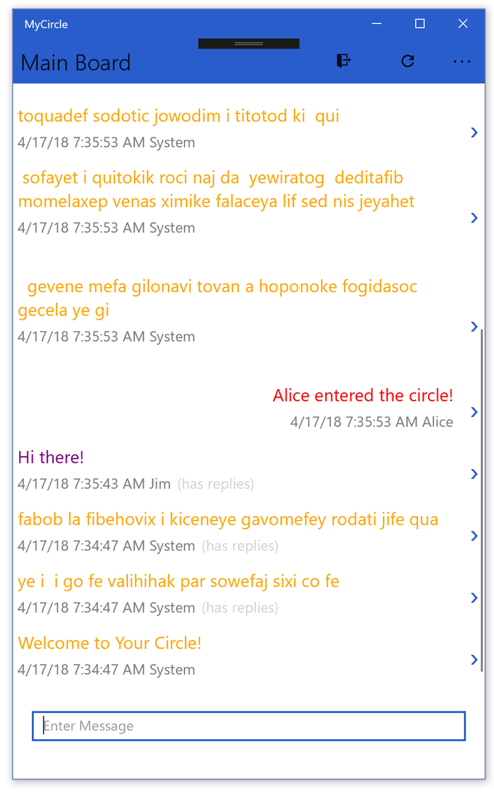
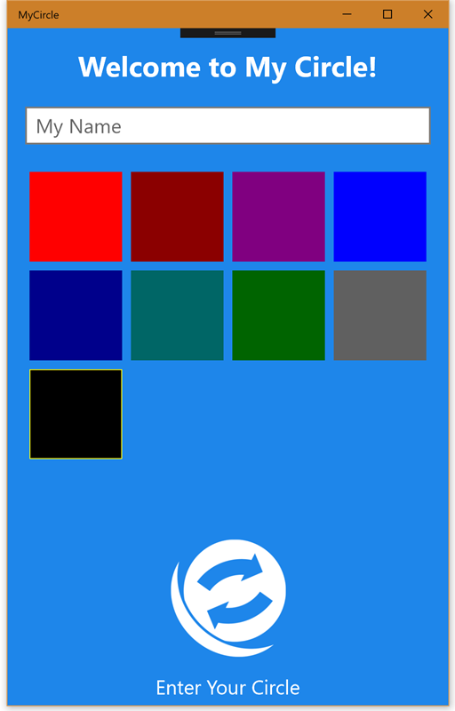
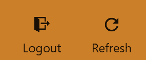
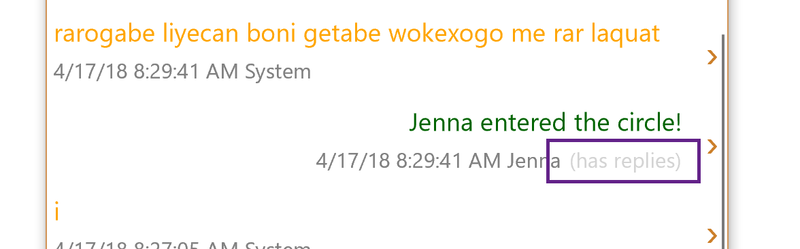

# Connect your mobile app to the cloud with Azure App Services

In this walk-through, we will modify a Xamarin.Forms application to utilize a few Azure services. We will be working with three specific services:

1. [Azure App Services for Mobile Apps](https://azure.microsoft.com/en-us/services/app-service/mobile/)
2. [Azure Speech to Text cognitive services](https://docs.microsoft.com/en-us/azure/cognitive-services/speech/home)
3. [Azure App Services Mobile App Offline Synchronization](https://docs.microsoft.com/en-us/azure/app-service-mobile/app-service-mobile-ios-get-started-offline-data)

We will start with an existing application which was built with Visual Studio. It has target projects for iOS, Android, Windows (UWP), and macOS. The instructions here are primarily oriented towards Visual Studio for Windows, however you can also use Visual Studio for Mac to complete this walk-through.

> **Note** This lab assumes you are running Visual Studio on Windows 10 Fall Creators Update. If you are using an older version of Windows, you might be unable to run the UWP version of the application. In this case, you can skip those sections and concentrate on either iOS and/or Android.

## What you will learn
We will be focusing on integrating in Azure services into the app structure - particularly the services built specifically for Mobile Apps. At the end of the walk-through, you will have a good understanding of how to leverage these services in your own apps, as well as a starting point to explore other Azure services.

The app we will be working with is a community chat application named **My Circle**. It's a very simple application which allows a group of people to communicate in a public forum. Initially, it will work with local data only (mostly generated randomly), our goal will be to connect this app to Azure and provide a global, cloud-based data store so the app becomes a community connected application.

 

We will add this support in three stages:

1. [Part 1](#part-one-add-support-for-azure) - We will add the initial support to connect our app to Azure App Services and store our data in the cloud.

2. **Part 2** - We will add support for Azure Speech to Text cognitive services.

3. **Part 3** - We will finish our app by adding support for offline data synchronization so the app continues to work properly when the network is unavailable.

## Download the code

You can download the code [here](https://github.com/XamarinUniversity/build2018-labs/archive/master.zip) as a .zip file, or clone the repo with the following command-line:

```shell
git clone https://github.com/XamarinUniversity/build2018-labs.git
```

> **Note:** There are two labs in this Github repository, make sure you are working with the contents of the **lab2** folder for this walk-through.

## Explore the Starter Solution

Let's start by exploring the starter solution. In the materials associated with this walk-through, you will find several folders:

| Folder    | Purpose |
|-----------|---------|
| **start** | The starting lab solution. |
| **part1** | The completed solution for Part 1 |
| **part2** | The completed solution for Part 2 |
| **part3** | The completed solution for Part 3 |

> It is recommended that you _copy_ each folder to another local location, preferably one with a short path to avoid any path restrictions on your development system.

1. Open the **MyCircle.sln** solution in the **start** folder.

2. There are five projects in this solution:
	- **MyCircle** - a .NET Standard shared-code project where all of our work will be done.
	- **MyCircle.Android** - the Xamarin.Android host which runs the app on the Android platform.
	- **MyCircle.iOS** - the Xamarin.iOS host which runs the app on the iPhone and iPad.
	- **MyCircle.Mac** - the Xamarin.Mac host which runs the app on macOS.
	- **MyCircle.UWP** - the Universal Windows host which runs the app on Windows 10.

We will be concentrating on the first project. This is a .NET Standard library which has all the shared code and UI definitions for the app.


### Data Folder

The **Data** folder holds model objects - these are underlying data objects which represent some state in our app. 

The only model object we have defined is the `CircleMessage` which is used to represent a single message sent or received from the app. It holds the Author, Color, and Text for a single message.

### Services Folder

The **Services** folder holds global services used by the application to perform some work.

| Service | Description |
|---------|-------------|
| `InMemoryRepository` | This is a sample in-memory implementation of the `IAsyncMessageRepository` interface. It is used in the starter to provide the storage for all the `CircleMessage` objects. We will replace this class in **part1** with a repository that connects to Azure. |
| `LoginService` | This service provides the ability for a user to login and logout of the application. |
| `UserInfo` | This service stores the currently logged on user in persistent storage using the built-in Xamarin.Forms properties collection. |

### ViewModels Folder

The app relies on the [Model-View-ViewModel design pattern](https://docs.microsoft.com/en-us/xamarin/xamarin-forms/enterprise-application-patterns/mvvm) to provide bindable view-centric data objects for the UI to display. The **ViewModels** folder defines each of our bindable ViewModels.

| ViewModel | Description |
|-----------|-------------|
| `BasePageViewModel` | A base class for `MainViewModel` and `DetailsViewModel` which have some shared functionality. In particular, this class supports adding a new `CircleMessage` to the system and providing a collection of `CircleMessageViewModel` objects for the UI to display. |
| `CircleMessageViewModel` | A bindable wrapper around the `CircleMessage` data model. |
| `DetailsViewModel` | The ViewModel for the `DetailsPage` |
| `LoginViewModel` | The ViewModel for the `LoginPage` |
| `MainViewModel` | The ViewModel for the `MainPage` |
| `ProfileColorViewModel` | A ViewModel to hold a `Color` and current selection used in the `LoginPage` |
| `SpeechTranslatorViewModel` | A ViewModel for the `SpeechTranslatorPage` |

### XAML User Interface definitions

The app uses [XAML](https://docs.microsoft.com/en-us/xamarin/xamarin-forms/xaml/xaml-basics/) to construct and display the user interface for each page. Each XAML file has a corresponding code-behind (**xam.cs**) file, which may have a little connecting logic in it, particularly for navigation. However, most of the programmed logic is contained in the [ViewModels Folder](#viewmodels-folder).

| XAML | Description |
|------|-------------|
| **App.xaml** | The main `Application` for the app - this is a singleton which is created as part of the app launch sequence and is the starting point for the app. |
| **DetailsPage.xaml** | This page displays the thread details for a conversation. At the top is the starting point, and then each response is displayed in a scrollable list. |
| **LoginPage.xaml** | This page is the first displayed UI in the app when the app has not been launched before. It allows the user to enter their name and select a color for their messages. You can also reach this app by tapping the Logout button on the main page. |
| **MainPage.xaml** | This page is the primary page which displays all the "root" conversations - these are starting points for any conversation thread. You can tap on a specific message to display the details. |
| **MessagesView.xaml** | This is a `ContentView` which is shared between the **MainPage.xaml** and **DetailsPage.xaml** to display a list of messages and a "New Message" `Entry` UI widget. |
| **SpeechTranslatorPage.xaml** | This is a starting point for the UI related to **part2** of the lab. It is incomplete and will be utilized as part of that step. |

## Run the starter application

1. Build the application in Visual Studio.

2. Select one of the supported platforms and set it as the Startup Project by right-clicking on the project in the Solution Explorer and selecting *Set as Startup*. Alternatively, you can use the platform drop-down in the toolbar which is next to the **Play** button.


> **Note:** The UWP app is only available if you are running on Windows, and the Mac app is only available if you are running on macOS. In addition, you must have a Mac to run the iOS project.

3. Run the application by clicking the **Play** button in the toolbar, or through the menu. Initially, you will be shown the **LoginPage**:



4. Type your name and select a color. Then tap the Circle icon at the bottom to enter the app.

5. You will now be presented with a series of messages.


6. The Toolbar at the top has two icons:



7. Tap the "Refresh" icon to see new messages. Alternatively, on iOS and Android, you can use the "Pull to refresh" gesture. These new messages are generated internally by the app for testing.

8. You can add your own message by typing it into the `Entry` at the bottom of the page and pressing **ENTER** or **RETURN**.

9. Finally, when there is a response to a root message here, you will see a text marker indicating that replies are available:



10. You can tap on that message to see the details, or to enter your own response.

## Create the Azure Mobile App Service

Let's start by creating an Azure Mobile App Service that our mobile app can use to store data in the cloud. There is an existing version of this service located at https://build2018mycircle.azurewebsites.net, however it likely won't be around forever, so you can use these steps to create your own version of the service. 

If you want to use the pre-supplied service, you can skip to [Part One](#part-one-add-support-for-azure) where we will add support for Azure to the app.

> **Note**: at this time, this part of the lab can only be done on Visual Studio for Windows. Once you have the service, you can use Visual Studio for Mac; alternatively, you can create the service using the [Azure Portal](https://portal.azure.com).

### Create the build2018mycircle solution

1. Open Visual Studio for Windows.

2. Use the **File** > **New** > **Project...** menu option to open the New Project wizard

3. Select the **Visual C#** > **Web** > **ASP.NET Web Application (.NET Framework)** template.


4. Name the solution **build2018mycircle**.

5. Click **OK** to start the wizard.


### Set the web app options

1. Select **Azure Mobile App** from the set of choices.

2. Leave all other options as their defaults and click **OK** to create the web app.


### Change the default model to CircleMessage

The wizard created a default data object (**TodoItem**) and controller (**TodoItemController**) to manage a table. You can either create a new controller + data item, or rename this one since we aren't going to use it. We'll choose the latter in this walk-through.

1. Expand the **DataObjects** folder in the project.

2. Locate the **TodoItem.cs** source file and open it.

3. Right-click on the class name and select **Rename**. Type **CircleMessage** as the new class name.

4. Rename the file in the Solution Explorer to match the new class name. An easy way to do this in VS for Windows is to use the **Quick Actions and Refactorings...** menu (accessible through a right-click on the class, or **CTRL+.**)

5. Change the properties in the class definition to match our mobile app version of the definition:

```csharp
public class CircleMessage : EntityData
{
    public bool IsRoot { get; set; }
    public string ThreadId { get; set; }
    public string Author { get; set; }
    public string Text { get; set; }
    public string Color { get; set; }
}
```

### Rename the TodoItemController

1. Expand the Controllers folder in the Solution.

2. Open the **TodoItemController.cs** file.

3. Rename the class and file (using the same steps as above) to **CircleMessageController**.

4. Go through the class and replace all text references of "Todo" with "CircleMessage". This mostly affects comments, but there are a few method names which are changed too. You can do a global rename within the class if you like - these methods aren't referenced in code anywhere but are instead dispatched through the ASP.NET MVC framework.

### Rename the DbSet accessor

1. Expand the **Models** folder in the Solution.

2. Locate the **MobileServiceContext.cs** file and open it.

3. In this file, locate the **TodoItems** property and rename it to **CircleMessageItems**.

### Fix the MobileServiceInitializer

1. Expand the **App_Start** folder in the Solution.

2. Locate the **Startup.MobileApp.cs** file and open it.

3. At the bottom you will find a class named `MobileServiceInitializer` with a `Seed` method. This method is used to initialize an empty database with an initial dataset.

4. You can either replace the code with some default `CircleMessage` objects (just follow the same code pattern given for the `TodoItem` objects), or remove the method altogether if you don't want any initial data in the database.

### Publish the service to Azure

1. Build the service to make sure everything is renamed correctly.

2. Right-click on the project in the Solution Explorer and select **Publish**.

3. Select **App Service** from the side-bar, and **Create New** on the right side.

4. Click **Create Profile** to start the service creation. This will load your available subscriptions in Azure. You will need to have an account (a free one is fine) and it will prompt you to create one or to login if you are not currently logged in.

5. Give the app a name - this will become your URL which the mobile app will need to know.

6. Pick the subscription group, resource group, and hosting plan.

7. On the right side, click the **Create a SQL Database** link.

8. Select or create a SQL Server to host your database - you will need the admin username and password.

9. Click **OK** to add the database configuration.

10. Click **Create** to publish the service - this will take a few minutes. When it's finished, your app will be running in Azure using the following URL:

```
https://<APPNAME>.azurewebsites.net
```

## Part One: add support for Azure

In this first part, we will replace our test `InMemoryRepository` class with an Azure version that connects to an existing Azure Mobile App Service.


1. Add Microsoft.Azure.Mobile.Client NuGet to all projects.
2. Create AzureMessageRepository.cs
3. Implement IMessageRepository
4. Add MobileServiceClient field and initialize with "https://build2018mycircle.azurewebsites.net"
5. Add `IMobileServiceTable<CircleMessage> messages;`
6. Initialize messages with `client.GetTable<CircleMessage>();`

7. Modify CircleMessage data structure
	a) Rename `CreatedDate` to `CreatedAt` and make `DateTimeOffset?`
	b) Remove setter for `Id` and `CreatedAt` in ctor

8. Implement interface
9. Replace repository in `App.xaml.cs`
10. Run the app and see server data.


1. Add Xam.Plugin.SimpleAudioRecorder (pre-release)
2. Add Xam.Plugin.SpeechToText (myget)
   - need to add feed: https://www.myget.org/F/speech-to-text/api/v2
   - Key: fb3c4e67a81242f794cb56ebb279271d
3. Add code to SpeechTranslatorViewModel.cs
4. Add permissions to UWP project (appxmanifest - Capabilities - Microphone)
5. Add permission to iOS info.plist (hand edit)
	<key>NSMicrophoneUsageDescription</key>
  	<string>Record my voice for Speech to Text</string>
6. Add permissions to Android Manifest
	- MODIFY_AUDIO_SETTINGS, RECORD_AUDIO, READ_EXTERNAL_STORAGE & WRITE_EXTERNAL_STORAGE
7. Add Plugin.Permissions component to all projects.
8. Add Android permissions pieces to MainActivity
	- CrossCurrentActivity.Current.Activity = this; // OnCreate
	- OnRequestPermissions
9. Add code to request mic permission into ViewMOdel
10. Call method from OnStartRecording

```
private async Task<bool> RequestAudioPermissions()
{
    try
    {
        var status = await CrossPermissions.Current.CheckPermissionStatusAsync(Permission.Microphone);

        if (await CrossPermissions.Current.ShouldShowRequestPermissionRationaleAsync(Permission.Microphone))
        {
            var results = await CrossPermissions.Current.RequestPermissionsAsync(Permission.Microphone);
            if (results.ContainsKey(Permission.Microphone))
                status = results[Permission.Microphone];

            if (status == PermissionStatus.Granted)
            {
                return true;
            }
        }
    }
    catch
    {

    }
    return false;
}
```

## Part3

1. Add Microsoft.Azure.Mobile.Client.SQLiteStore to all projects
2. Add VC2015 runmtime lib to UWP app
2. Need a parameterless ctor on CircleMessage!
3. Add InitializeTableAsync, InitializeOfflineStorageAsync, and SynchronizeAsync to Azure repo
4. Call Synchronize in each method.
..
5. Add Xam.Plugin.Connectivity to all projects
6. Update SynchronizeAsync to check connectivity .. fun test: use if (true) to exit early and show that it's cached offline with no sync.
..
7. Add pushChanges to Synchronize and set to false when using GetXXX methods.
..
7. Add ResolveConflictAsync method
8. Add Version field to CircleMessage
9. Implement IEquatable<CircleMessage> on CircleMessage .. Test Id, Text, Color, ThreadId.
..
10. Add PurgeOldRecordsAsync, call at end of InitializeTableAsync

> CAN UNINSTALL APP TO FORCE A FULL CACHE CLEAR!
